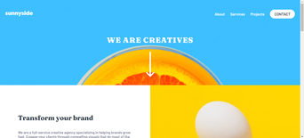
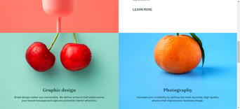
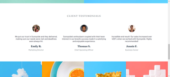
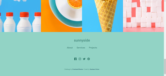
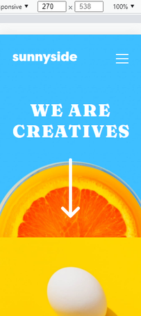
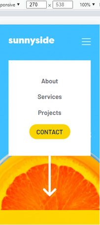
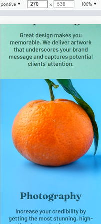
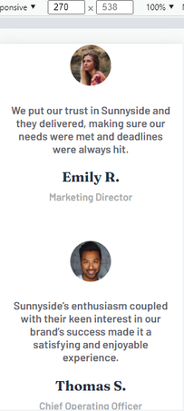

# Sunnyside agency landing page

Langing page of a sunnyside agency

🚀 Project Completed ✅

## Table of contents

- [Overview](#overview)
  - [About](#-about)
  - [The challenge](#-the-challenge)
  - [Screenshot](#-screenshot)
    - [Desktop](#-desktop)
    - [Mobile](#-mobile)
  - [Links](#-links)
- [My process](#-my-process)
  - [Built With](#built-with)
    - [Languages](#languages)
    - [Utilities](#utilities)
  - [What I learned](#-what-i-learned)
  - [Continued development](#-continued-development)
- [Author](#-author)
- [License](#-license)

## Overview

### ❓ About 

This is a solution to the [Sunnyside agency landing page challenge on Frontend Mentor](https://www.frontendmentor.io/challenges/sunnyside-agency-landing-page-7yVs3B6ef). Frontend Mentor challenges help you improve your coding skills by building realistic projects.

### ⚙️ The challenge

Users should be able to:

- [x] View the optimal layout for the site depending on their device's screen size
- [x] See hover states for all interactive elements on the page

### 🎨 Screenshot

#### 💻 Desktop

#### 📱 Mobile

### ⚓ Links

- [Website hosted on github pages]()

## 🛠 My process

### Built with

The following tools were used in the construction of the project:

#### Languages
- [HTML5](https://developer.mozilla.org/pt-BR/docs/Web/HTML)
  - Semantic HTML5 markup
- [CSS3](https://developer.mozilla.org/pt-BR/docs/Web/CSS)
  - CSS custom properties
  - Flexbox
  - Mobile-first workflow
- [JavaScript](https://www.javascript.com/) 

#### Utilities 
- **Fonts**:
  - [Barlow](https://fonts.google.com/specimen/Barlow)
  - [Fraunces](https://fonts.google.com/specimen/Fraunces)

### 🥇 What I learned

During the project development I could learn more about mobile first and flexbox using CSS.

### ⏪ Continued development

To continue this project, I would recommend trying to develop the other pages on the site and also trying to implement the Grid layout instead of just using the flexbox layout, as I think it would be an interesting challenge for you to train your skills.

## 🦸 Author

Made with ❤️ by Gustavo Souza. 👋 [Get in touch](https://www.linkedin.com/in/gustavo-victor-575b93206/)

- GitHub - [@Gustavo-Victor](https://github.com/Gustavo-Victor)
- Frontend Mentor - [@Gustavo-Victor](https://www.frontendmentor.io/profile/Gustavo-Victor)
- CodePen - [@gustavo_victor](https://codepen.io/gustavo_victor)
- Linkedin - [@gustavo-victor](https://www.linkedin.com/in/gustavo-victor-575b93206/)

## 📝 License 

This project is under the [MIT license](./LICENSE).

Anyone can use, clone, fork and contribute to this project.
